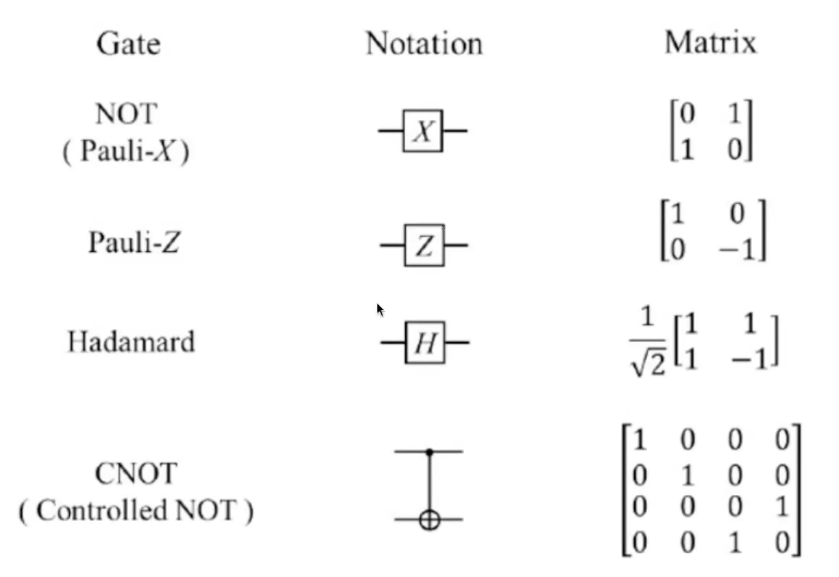

## Certificación Profesional en Quantum Computing: Bases, Roadmap y Aplicaciones

### Perfil del participante

Ingenieros/as de diversas ramas, especialistas en Inteligencia Artificial, desarrolladores/as de software, responsables de desarrollos de nuevos negocios basados en tecnologías y todos/as aquellos que deseen conocer los alcances de esta nueva tecnología. 

### Objetivos

- Brindar los conocimientos suficientes para adentrarse en la tecnología de la Computación Cuántica y su potencial implicancia en la formación y/o trayectoria profesional del participante.
- Aportar los conceptos y principios fundamentales sobre cómo funciona una computadora cuántica y sus aplicaciones en la Industria y la Academia, como así también sus limitaciones
- Brindar herramientas para identificar problemas que pueden ser resueltos por la Computación Cuántica.
- Presentar el roadmap de la Computación Cuántica, su situación presente y futura.
- Aportar a la comprensión sobre cuáles son todos los requerimientos técnicos y de conocimiento necesarios para encarar diferentes proyectos de Computación Cuántica.

### Metodología

Durante la certificación se realizarán encuentros sincrónicos de desarrollo de contenido, presentación de materiales y se propondrán trabajos grupales. De forma asincrónica se compartirán materiales que los y las estudiantes deberán revisar y actividades que refuercen lo trabajado en los encuentros sincrónicos.

En las clases sincrónicas el docente realizará exposiciones de temas teóricos presentando los diferentes enfoques de la Computación Cuántica, y también se harán sesiones prácticas donde se presentará código en lenguaje Python para poder ser ejecutado tanto de manera local en las PCs de los alumnos, como en computadoras cuánticas reales.

### Conocimientos adquiridos al finalizar el programa

- Comprensión de los fundamentos que dan origen a la Computación Cuántica y sus aplicaciones en la industria y la academia.
- Capacidad para plantear casos de uso, gestionar proyectos de implementación y dimensionar su impacto en la industria y academia.
- Determinar cuándo la tecnología podrá resolver problemas reales y cuáles son sus limitantes.
- Capacidad para programar computadoras cuánticas reales y desarrollar programas que resuelvan problemas sencillos.

### Conocimientos mínimos para cursar el programa

Si bien el curso es para principiantes, se recomiendan conocimientos mínimos para adentrarse en el mundo de la Computación Cuántica en las áreas de:

- Matemática:
  - Probabilidad
  - Funciones Complejas
  - Cálculo Numérico 
  - Álgebra Lineal: operaciones con vectores y matrices

- Lenguajes de Programación
  - Conceptos básicos de lenguaje Python o similar

### Requisitos para aprobar el programa:

Asistencia igual o superior al 75%.

Aprobación de evaluación final. Se podrá elegir entre una de las dos opciones:

- Entrega de un trabajo teórico
- Entrega de un código en Python que resuelva un problema sencillo

### Plan de estudios

### Módulo 1. Conceptos fundamentales de la computación cuántica
- Qué es la computación cuántica
- Cuáles son los principios en los que se basa
- Cuál es el concepto de qubit
- Diferencias con la Computación Clásica
- Qué tipo de problemas resuelve

### Módulo 2. Aplicaciones en la industria
- Casos de Uso en las Industrias de:
  - Ciberseguridad
  - Salud y Genética
  - Finanzas
- Computación Cuántica para resolver problemas de Simulación y Optimización
- Por qué es necesario comenzar ya con el estudio y prototipado de las soluciones cuánticas

### Módulo 3. Introducción a las compuertas y circuitos cuánticos
- Qué son los circuitos cuánticos y cómo pueden generarse
- Qué son las compuertas cuánticas
- Qué herramientas disponemos para trabajar con circuitos cuánticos y sus diferentes aproximaciones

### Módulo 4. Introducción a los algoritmos cuánticos
- Introducción al Algoritmo de Deutsch
- Introducción al Algoritmo de Shor
- Introducción al Algoritmo de Grover
- Introducción al Algoritmo de Simon

### Módulo 5. Introducción a la ingeniería de software cuántico
- Principio de la programación para computadoras cuánticas
- Buenas prácticas
- Diferencias con la programación clásica
- Qué conocimientos se necesitan para desarrollar una aplicación o sistema cuántico
- Introducción al framework de programación cuántica: Qiskit

### Módulo 6. Trabajando con computadoras físicas reales
- Demostración de un programa realizado en Python que corra en máquinas cuánticas tanto en similares como de hardware real.
_______ 

### **Clase 1 – Introducción a la Computación Cuántica**: 

**El experimento de la doble rendija**

El experimento de la doble rendija demuestra la dualidad onda-partícula de la luz y la materia.
Cuando se hace pasar un haz de partículas (como fotones o electrones) por dos rendijas, se observa en la pantalla un patrón de interferencia, típico de las ondas.
Sin embargo, si se intenta observar por cuál rendija pasa cada partícula, el patrón desaparece, y las partículas se comportan como corpúsculos individuales.
Este experimento revela la naturaleza probabilística y no determinista del mundo cuántico.

**Interferencia cuántica**

La interferencia cuántica ocurre cuando las funciones de onda de distintas partículas (o del mismo sistema en diferentes caminos posibles) interfieren entre sí, combinando sus probabilidades.
Esto explica por qué un sistema cuántico puede mostrar efectos de cancelación o refuerzo en ciertas mediciones, dependiendo de cómo se superponen las amplitudes de probabilidad.

_👉 En términos prácticos, esta interferencia es la base del paralelismo cuántico que aprovechan los algoritmos cuánticos._

**Superposición cuántica**

Una partícula en superposición cuántica puede existir simultáneamente en varios estados posibles hasta que se realiza una medición.
Por ejemplo, un electrón puede estar en dos posiciones distintas, o un qubit puede representar “0” y “1” al mismo tiempo.
Al medirse, el sistema “colapsa” a un único estado.

Este principio no tiene un análogo en la física clásica, y es una de las bases que permite el poder de cómputo exponencial de las computadoras cuánticas.

**Entrelazamiento cuántico**

El entrelazamiento cuántico es un fenómeno donde dos o más partículas comparten un estado cuántico común, de modo que la medición de una afecta instantáneamente a las demás, sin importar la distancia que las separe.

Einstein lo llamó “acción fantasmal a distancia”.

Aunque la correlación es instantánea, no permite transmitir información más rápido que la luz, preservando los principios de la relatividad.

_💡 Este fenómeno es esencial para la teletransportación cuántica, la criptografía cuántica y los protocolos de corrección de errores cuánticos._

**Quantum gates**

Las compuertas cuánticas son los bloques fundamentales de los circuitos cuánticos, análogas a las puertas lógicas clásicas, pero operan sobre qubits mediante transformaciones unitarias.

Estas operaciones modifican el estado cuántico (amplitud y fase) del sistema.

	•	Hadamard (H): crea superposición.
	•	Pauli-X, Y, Z: rotaciones en los ejes del espacio de Bloch.
	•	CNOT: genera entrelazamiento entre dos qubits.
	•	T y S gates: aplican rotaciones de fase.

**Workflow para resolver un problema en una computadora cuántica**

_1. Mapear el problema a circuitos cuánticos y operadores_. Traducir el problema clásico a una representación cuántica: definir qubits, compuertas y, si corresponde, el Hamiltoniano que describe la evolución del sistema.

_2. Optimizar el circuito para el hardware objetivo_. Reducir la profundidad del circuito, Minimizar la sensibilidad al ruido, Adaptar la topología del circuito al conjunto de compuertas nativas del dispositivo.

_3. Ejecutar en el hardware objetivo (o simulador)_. Ejecutar el circuito cuántico optimizado en el backend elegido (dispositivo físico o simulador cuántico).

_4. Posprocesar los resultados_. Aplicar mitigación de errores y analizar los resultados de las mediciones para extraer el resultado clásico final.
